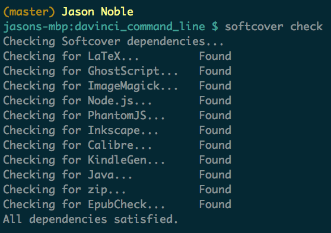

# Contributing

To contribute to this repo, you need some software installed locally.

## Install Gems

    bundle
    
## Update Homebrew

You need [Homebrew](http://brew.sh/) installed.

After installing homebrew, run the following:

    brew update
    
### Install kindlegen

    brew cask install kindlegen

### Install MacTex

    brew cask install mactex
    
You need to add _/Library/TeX/texbin_ to your PATH:

    # ~/.bash_profile
    export PATH=$PATH:/Library/TeX/texbin

### Install InkScape

    brew cask install inkscape
    
### Install Calibre

    brew cask install calibre
    
### Install epubcheck

    brew install epubcheck
    
### Install imagemagick

    brew install imagemagick
    
### Install ghostscript

    brew install ghostscript
    
### Install node

    brew install node
    
### Install phantomjs

    brew install phantomjs
    
## Verify Installation

    softcover check
    
Expected output:

    

